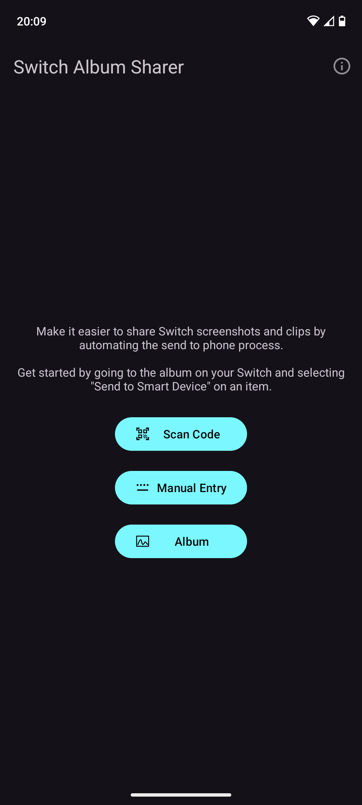
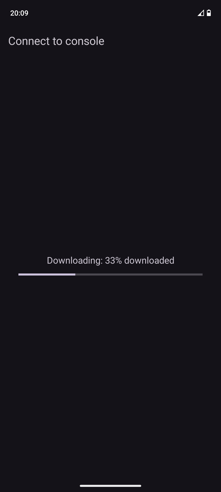
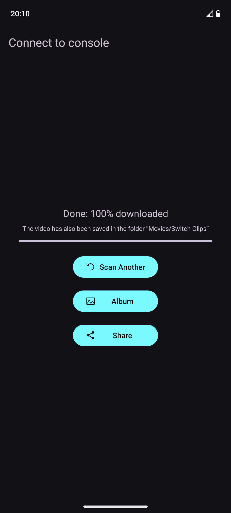
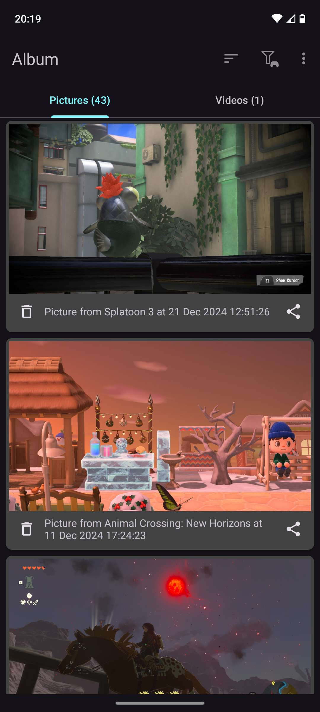

 
# Switch Album Sharer

Android app that makes it easier to share captured pictures/videos from a Nintendo Switch.

This app uses the "Send to Smart Device" functionality from the Album - it automates the process of connecting to the network and downloading the files; it gives you a share button for them when done.

It won't work with a Switch 2 since the "Send to Smart Device" option is missing, having been replaced with the ability to upload media and download it from the official Nintendo Switch app.

Libraries used: see [here](libraries.md)

## Screenshots

## Requirements:
* Android 10 (API level 29) or up
* Wi-Fi (to connect to the Switch)
* Camera (optional). One is needed to scan the QR code, but there's an option to enter the info manually
